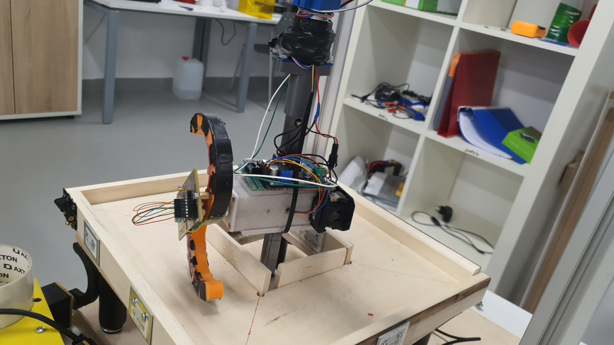

**Table of Contents**
- [](#)
- [Quick start](#quick-start)
  - [1. Start to work in computer environment](#1-start-to-work-in-computer-environment)
  - [2. Upload code to Jetson Nano](#2-upload-code-to-jetson-nano)
  - [3. Update code on STM32](#3-update-code-on-stm32)
  - [4. Calibrate force sensor](#4-calibrate-force-sensor)
- [Useful links](#useful-links)

# Introduction
## Motivation
This repository was made for support a scientific paper *"Design of a low-cost tactile sensor based on Velostat mounted on curved shapes"*. The goal of this paper to design a low-cost tactile sensor, which can be used to solve terrain classification problem. It means that we need to mount these sensors on C-like leg.



This repo contains code for:
* Arduino: send data from ground truth 1DOF force sensor Futek LTH350 to PC
* UR5: control manipulator and write down timestamps when it reach needed points
* Velostat tactile sensor: receive data from STM32, decode it and write down to file
* STM32: to receive data from sensor and encode it for sending to PC via RS485
* Postprocessing: Matlab code for making plots

## Experimental setup
field and UR5e


# Quick start
## 1. Start to work in computer environment
1. Build the dockerfile ```$ sh ./docker_configs/dockerfile.sh | docker build -t tactile_sensor_velostat -f - .```
2. * Either use ```sh start_to_work.sh``` (open 3 term tabs, with git, docker-compose and docker exec) (might be needed to do 2.2 before it, if simulator won't work)
   1. Or ```docker-compose -f docker-compose_nvidia.yml up``` if you have nvidia on a laptop, or ```docker-compose -f docker-compose.yml up``` if other (intel, amd)
   2.  ```$ sudo xhost +local:root```
   3.   ```docker exec -it --privileged tactile_sensor_velostat_ros-master_1 bash``` start to work in docker
3. Start to work

## 3. Update code on STM32
1. TODO


## 4. Calibrate force sensor


# Useful links
* [Futek LTH350 datasheet](https://www.futek.com/store/load-cells/through-hole-load-cells/donut-through-hole-LTH350/FSH04304)
